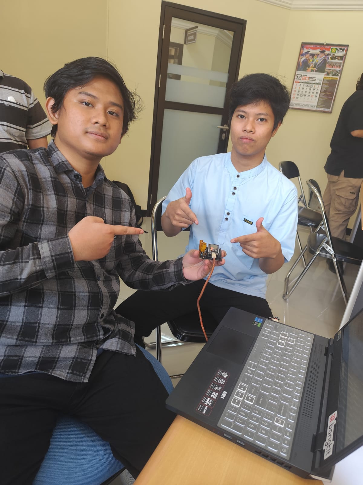
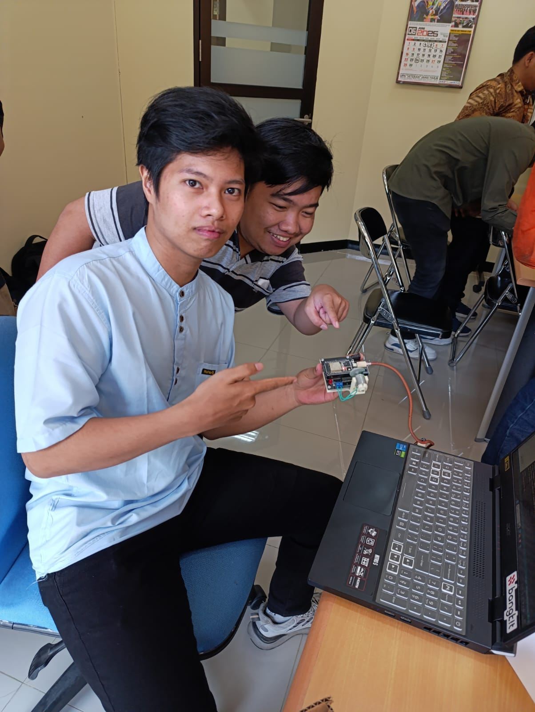
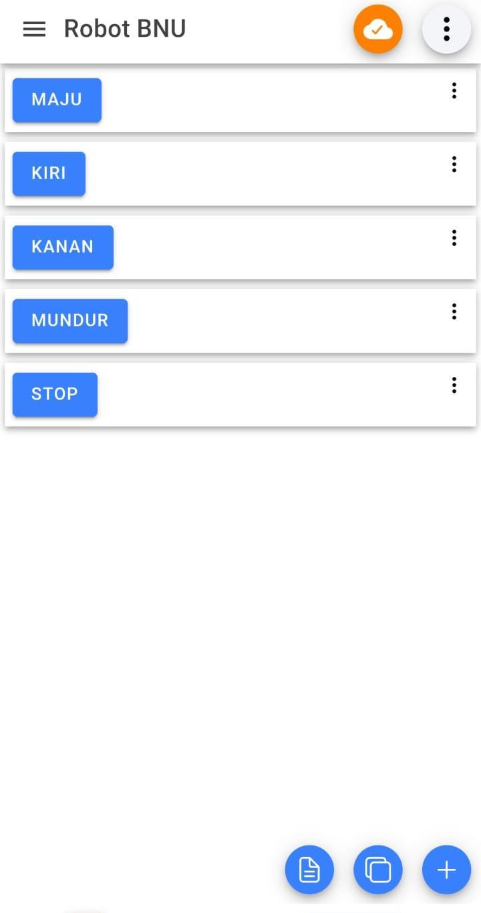
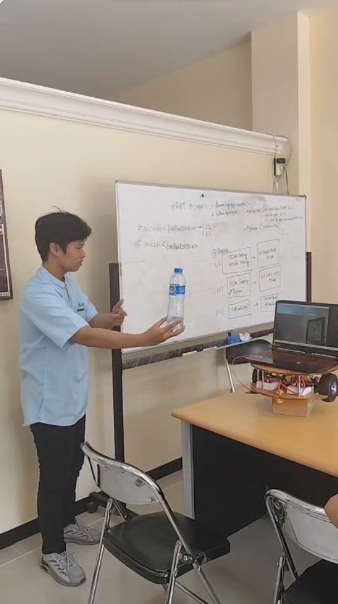
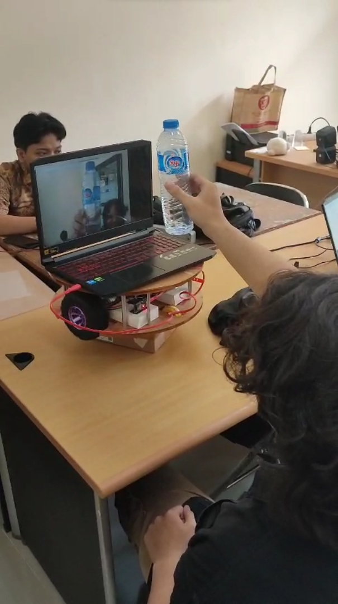
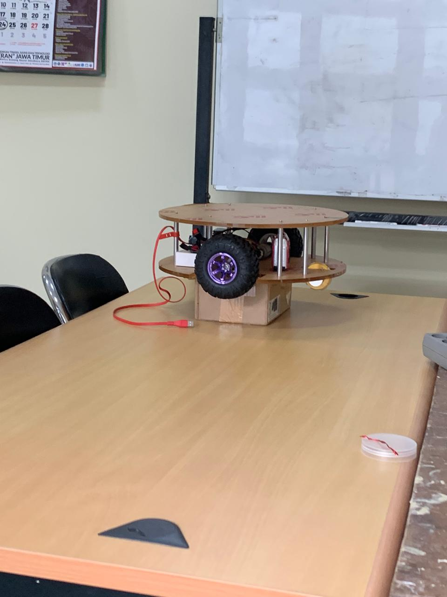

# 🤖 Robotika Learning Repository - Kegiatan Perkuliahan

## 1️⃣ Pertemuan Pertama

**[Perkenalan Mata Kuliah Robotik]**
Berkenalan dengan dosen pengampu, yakni Bpk. Basuki. Kemudian berkenalan sedikit tentang robotik. Pada tahap ini, kami menerima penjelasan mengenai apa saja yang akan dilakukan pada mata kuliah robotik, seperti skema pembelajaran, pengerjaan UTS hingga UAS.

## 2️⃣ Pertemuan Kedua

**[Instalasi Arduino IDE]**
Pengenalan dan instalasi Arduino IDE. Selain itu, kami juga mempelajari bagaimana cara melakukan instalasi beberapa library penting yang akan digunakan dalam pengerjaan project serta bagaimana konfigurasi setup yang diperlukan.

## 3️⃣ Pertemuan Ketiga

**[Praktik Arduino IDE dengan ITCLab]** 
Praktik langsung menggunakan ITCLab. Melakukan running program yang telah disediakan untuk menghidupkan dan mematikan LED. Fokus pada pemahaman konsep dasar pin digital pada Arduino IDE serta proses upload program ke board melalui ITCLab.

## 4️⃣ Pertemuan Keempat

**[Praktik Arduino IDE Dengan IMCLab]** 
Menghidupkan mesin pada ITCLab, yang di mana mesin tersebut nanti akan diaktifkan, ketika sudah aktif, mesin tersebut akan memutar "gerigi" yang telah dikonfigurasi dari cepat ke lambat. Jadi ketika awal dinyalakan, "gerigi" tersebut akan berputar secara cepat, kemudian semakin melambat, dan berhenti.

## 5️⃣ Pertemuan Kelima

**[Kontrol Motor Dengan IMCLab]** 
Mencoba mengendalikan motor dengan konfigurasi perintah dari Arduino IDE. Praktik pada pertemuan ini bertujuan untuk mengenal bagaimana penggunaan pin PWM dan dasar-dasar kendali penggerak melalui mikrokontroler.

## 6️⃣ Pertemuan Keenam

**[Pengenalan IoT dan MQTT Panel]** 
Menginstal aplikasi IoT MQTT Panel di handphone. Kemudian menghubungkan Arduino IDE ke MQTT dengan bantuan library PubSubClient, sehingga Arduino IDE dapat berkomunikasi melalui jaringan internet. Dalam konfigurasi, diperlukan sebuah hotspot dari handphone, kemudian memasukkan value nama hotspot beserta passwordnya pada sebuah kode dalam Arduino IDE.

## 7️⃣ Pertemuan Ketujuh

**[Praktik Kontrol Robot BNU V2 Via IoT MQTT Panel]**
Mengendalikan robot BNU V2 dengan menggunakan aplikasi IoT MQTT Panel. Kami mengirimkan sebuah perintah melalui MQTT Panel yang diterjemahkan menjadi aksi pada robot secara real-time. Praktik ini bertujuan untuk memahami penerapan praktis tentang komunikasi IoT menggunakan protokol MQTT.

##

 

# 🤖 Robot BNU: Deteksi Objek Real-time dengan PyTorch dan MobileNet

### Kelompok Peneliti

| Nama                | NIM         |
| ------------------- | ----------- |
| Yudhistira Nanda K. | 22081010055 |
| Daniel Perdana M.   | 22081010064 |
| Ferry Hasan         | 22081010085 |
| Suwito              | 22081010102 |
| Jerry Ramadhani C.  | 22081010140 |

## 📌 Deskripsi Singkat Proyek

Proyek ini bertujuan untuk membangun kode program untuk identifikasi objek melalui kamera secara realtime berbasis CNN (Convolutional Neural Network) menggunakan arsitektur MobileNet dari 91 kategori objek yang sudah di pre-trained. Berikut dokumen [Proposal PKM-KC ](<./Proposal PKM - KC 2025 Robotika.pdf>).

## 📝 Pendahuluan

  
  
  

Proyek ROBOT BNU ini adalah sistem robotik cerdas yang mampu melakukan deteksi objek secara real-time. Menggunakan model **SSDLite320-MobileNetV3-Large** dari PyTorch, robot dapat mengidentifikasi berbagai objek di lingkungannya melalui kamera. Informasi ini kemudian digunakan untuk mengirim perintah ke mikrokontroler Arduino, memungkinkan robot bereaksi, terutama untuk menghindari tabrakan.

Proyek ini adalah contoh penerapan **Artificial Intelligence (AI)** dan **Machine Learning (ML)** dalam robotika, membangun dasar untuk perilaku otonom yang lebih kompleks.

## ⭐ Fitur Utama

- Deteksi objek **real-time** menggunakan webcam.
- Memanfaatkan model **SSDLite320-MobileNetV3-Large** untuk inferensi yang efisien.
- Berkomunikasi dengan Arduino melalui port serial.
- Logika sederhana untuk **menghindari tabrakan**: robot berhenti jika objek terlalu dekat.
- Menampilkan kotak pembatas, nama kelas, dan skor keyakinan pada umpan video.

## ⚙️ Cara Kerja

1.  **Inisialisasi:** Menghubungkan Arduino, memuat model SSDLite-MobileNet, dan daftar nama kelas.
2.  **Pemrosesan Video:** Mengambil frame dari webcam, mengubah ukurannya, dan mengonversinya menjadi tensor untuk model.
3.  **Deteksi Objek:** Model memproses tensor dan menghasilkan kotak pembatas, skor, serta label objek yang terdeteksi.
4.  **Logika Kontrol:**
    - Jika terdeteksi `__background__` (tidak ada objek relevan), kirim `0` (berhenti/idle).
    - Jika objek terdeteksi dan ketinggian kotak pembatas **lebih dari 800 piksel** (objek sangat dekat, \< 1 meter), kirim `4` (henti darurat).
    - Jika objek terdeteksi tapi tidak terlalu dekat, kirim `1` (maju).
5.  **Komunikasi Arduino:** Perintah (`'0'`, `'1'`, atau `'4'`) dikirim ke Arduino hanya jika ada perubahan perintah.
6.  **Visualisasi:** Menampilkan hasil deteksi pada umpan video.

## 📋 Perancangan Logika Kontrol dan Komunikasi

- **Logika Kontrol Robot:** Dikembangkan logika sederhana untuk menginterpretasikan hasil deteksi menjadi perintah gerakan robot:
  - Jika tidak ada objek yang terdeteksi relevan (atau deteksi _background_), robot diberi perintah `'0'` (berhenti/idle).
  - Jika objek terdeteksi dan ketinggian kotak pembatas (`bbox_height`) **lebih dari 800 piksel** (diasumsikan objek sangat dekat, mis. kurang dari 1 meter), robot diberi perintah `'4'` (henti darurat). Heuristik ketinggian kotak pembatas ini digunakan sebagai estimasi kasar jarak.
  - Jika objek terdeteksi tetapi ketinggian kotak pembatas di bawah ambang batas (objek tidak terlalu dekat), robot diberi perintah `'1'` (maju).
  - Prioritas diberikan pada deteksi yang menunjukkan bahaya terdekat.
- **Komunikasi Serial:** Pustaka `pyserial` digunakan untuk membangun koneksi serial antara skrip Python dan Arduino. Perintah karakter (`'0'`, `'1'`, `'4'`) dikirim secara efisien, hanya ketika ada perubahan status perintah untuk menghindari transmisi berulang yang tidak perlu.

## 📈 Hasil dan Evaluasi

### A. Deteksi Objek Real-time

Sistem berhasil melakukan deteksi objek secara real-time pada umpan video webcam. Model SSDLite-MobileNetV3-Large menunjukkan performa yang baik dalam mengidentifikasi berbagai objek yang umum ditemukan dalam lingkungan operasional robot, dengan menampilkan kotak pembatas, nama kelas, dan skor kepercayaan secara visual pada _frame_. Kecepatan inferensi model cukup memadai untuk aplikasi real-time, terutama jika didukung oleh GPU.

### B. Respons Robot

Robot menunjukkan kemampuan dasar untuk merespons objek yang terdeteksi:

- **Maju:** Robot dapat bergerak maju ketika tidak ada objek di jalur yang mengindikasikan bahaya.
- **Berhenti (jarak aman):** Robot berhenti ketika objek terdeteksi dan diasumsikan sangat dekat (berdasarkan ketinggian kotak pembatas). Ini menunjukkan kemampuan dasar penghindaran tabrakan.
- **Kontrol Serial:** Komunikasi antara Python dan Arduino berfungsi dengan baik, memastikan perintah kontrol robot diterima dan dieksekusi secara tepat waktu.

### C. Keterbatasan dan Pembelajaran

- **Estimasi Jarak Heuristik:** Penggunaan ketinggian kotak pembatas sebagai proxy untuk estimasi jarak adalah metode yang sederhana namun memiliki keterbatasan akurasi. Faktor-faktor seperti ukuran sebenarnya objek dan sudut pandang kamera dapat memengaruhi interpretasi jarak ini. Untuk estimasi jarak yang lebih presisi, integrasi sensor kedalaman (misalnya, LiDAR atau kamera kedalaman) akan sangat meningkatkan keandalan.
- **Logika Navigasi Sederhana:** Sistem saat ini hanya mendukung perintah "maju" dan "berhenti". Untuk otonomi yang lebih tinggi, diperlukan pengembangan logika navigasi yang lebih kompleks, seperti berbelok untuk menghindari rintangan atau mengikuti jalur.
- **Robustness:** Kondisi pencahayaan yang bervariasi atau lingkungan yang sangat ramai dapat memengaruhi akurasi deteksi dan konsistensi respons robot.

Secara keseluruhan, proyek ROBOT BNU berhasil membangun fondasi yang kuat untuk robot otonom dengan kemampuan deteksi objek real-time. Meskipun ada beberapa area untuk peningkatan, hasil yang dicapai menunjukkan potensi besar penerapan AI/ML dalam sistem robotik.

## ⛓️ Protokol Komunikasi Arduino

- `'0'`: Tidak ada objek terdeteksi / latar belakang. Robot berhenti atau diam.
- `'1'`: Objek terdeteksi, jarak aman. Robot bergerak maju.
- `'4'`: Objek terlalu dekat. Robot segera berhenti.

## 🧪 Peningkatan di Masa Depan

- Navigasi yang lebih canggih (belok kiri/kanan).
- Penanganan banyak objek.
- Estimasi jarak yang lebih akurat dengan sensor kedalaman.
- Peningkatan ketahanan sistem.
- Antarmuka pengguna grafis (GUI).
- Optimasi model lebih lanjut.
- Pelatihan model dengan dataset khusus.

## 📽️ Video Uji Coba Robot BNU Deteksi Objek Real-time dengan PyTorch dan MobileNet

[Video Dokumentasi Uji Coba Robot BNU + ML + AI](https://youtube.com/shorts/RmWLLxDKOCI)
